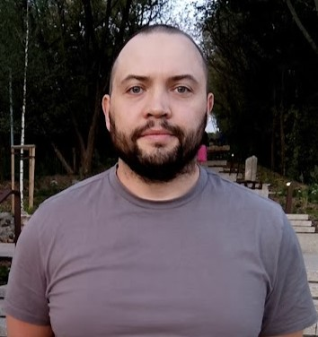

# CV


## Full Name: Khalunin Pavel



### 1. Contact Information

Poland Szczupa 11, 03-105 Warsaw

Date of birth: 31st May 1996 

E-mail: wol1414@gmail.com

### 2. My Goals

I want to learn native javascript at a good level and to become a full-fledged developer.

To learn the correct development and layout techniques, I am not sure that I am making the right one. Learn to work correctly in a team, work with git (now there is no special need to use). And of course to raise the level of earnings

### 3. My Skills

* Layout of sites of varying complexity - landingpage (I can implement on WordPress), online stores, corporate sites, business card sites, + app for gas stations.
* For this I use bootstrap 4, jquary 3 and various plugins.
* I try to stick with BEM.
* Git / GitHub Pages I use as a hosting for demonstration of work to the customer and as a portfolio.
* Javascripts know at the level of jquary.
* For work I use gulp, scss, pug, svg-sprite, programs: VScode, avacode, figma, zeplin, Photoshop, illustrator (create SVG).

### 4. Code Examples
```
  <a class="avatar" href="#" title="Khalunin Pavel"> 
    
    <div> Kalunin Pavel  photo</div>
  </a>
```

[here](https://pashawol.github.io/)

### 4. Work Experience

1. MSA-IT - Junior  Frontend developer. (2017)
1. Freelance -Webmaster - (2014-)

### 4. Education 

1. BNTU - technologist.

2. Programming and versioning are various courses on the Internet, youtube channels, articles and books.

### 4. English level

A2-B1